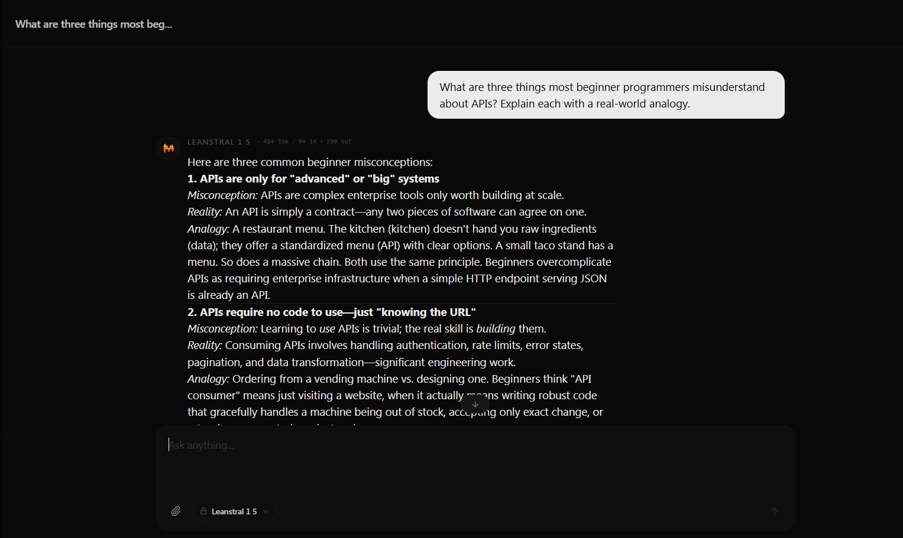
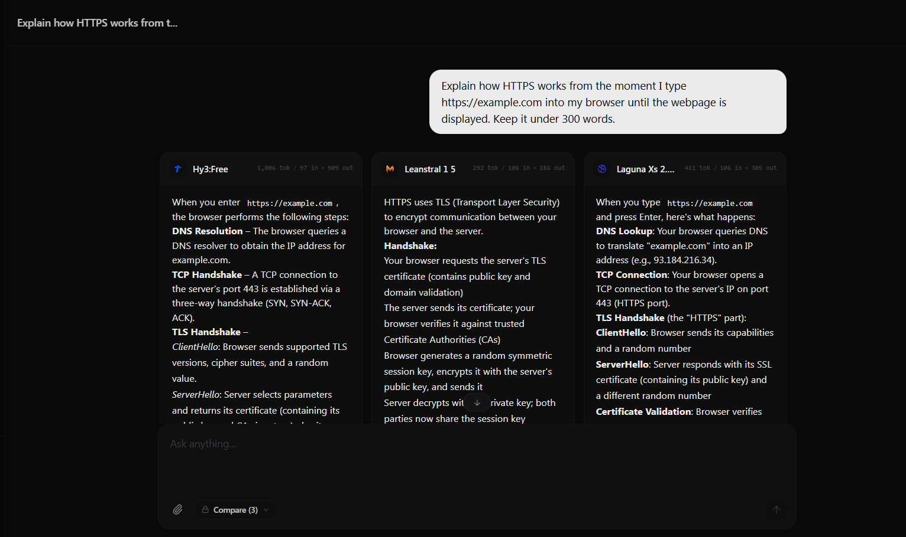
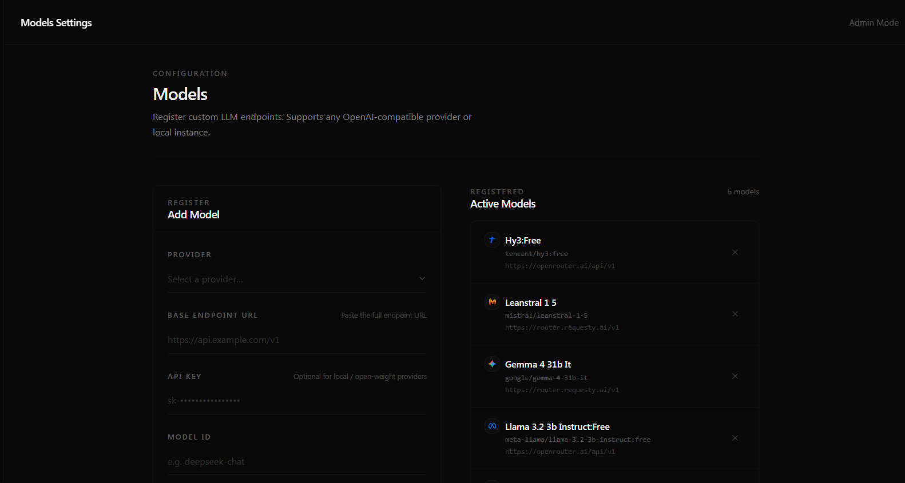
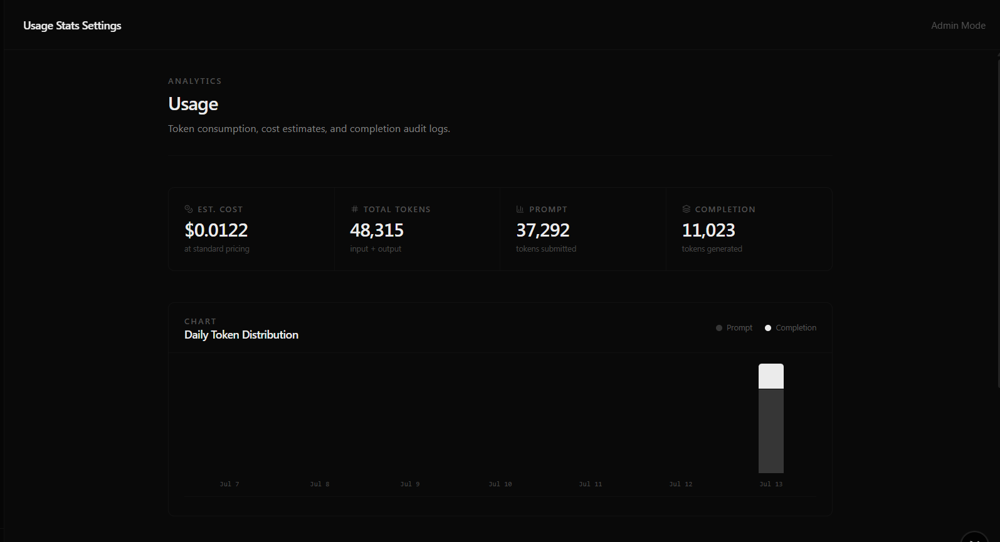

# AutarkChat

**AutarkChat** is a developer-first AI chat workspace for interacting with, comparing, and evaluating multiple language models from a single interface.

Configure custom providers, compare model responses side-by-side in real time, analyze token usage, and personalize system prompts—all within a fast, resilient workspace built for experimentation and everyday use.

---

## Features

### Multi-Model Comparison

Compare responses from up to three models simultaneously with synchronized streaming. Responses render independently, ensuring slower providers never block faster ones.

### Streaming Built for Reliability

- Responses are persisted immediately after completion.
- Failed or interrupted models do not affect successful ones.
- Active generations can be cancelled instantly.
- User input is automatically restored after network interruptions.

### Custom Model Registry

Connect any OpenAI-compatible provider by configuring your own endpoints.

Examples include:

- OpenAI
- OpenRouter
- DeepSeek
- Gemini
- Mistral
- Together AI
- Groq
- Tencent
- Any OpenAI-compatible API

### Personalization

Create reusable profiles containing your preferred name, occupation, and background context. This information is automatically injected into every conversation.

You can also define global custom instructions that are included in each system prompt.

### Token Analytics

Inspect prompt, completion, and total token usage directly within chat messages and comparison sessions to better understand cost and efficiency.

### Session Management

Manage active sessions across devices, inspect login activity, and revoke sessions when needed.

### Skills Registry & Command Execution

Extend assistant capabilities with multi-file scripts and procedures (e.g. PDF form parsers, image generators, math utilities).
- **Control Center**: Install, uninstall, enable, or disable custom workspace skills on the fly.
- **Terminal execution**: Exposes an execution tool permitting the AI to run Python scripts or shell utilities directly on local files.
- **Collapsible Consoles**: Chronological terminal outputs are formatted inside message bubbles with real-time `stdout`/`stderr` logging.

--- 

## Why AutarkChat?

AutarkChat is designed for developers who regularly evaluate models rather than simply chat with them.

It focuses on:

- Fast side-by-side evaluation
- Reliable streaming
- Provider flexibility
- Token transparency
- Clean, distraction-free interface
- **Consolidated Billing (One Bill, No Separate AI Subscriptions)**: Stop subscribing to multiple distinct consumer AI plans. Bring your own developer API keys or connect proxy routers (like OpenRouter, Together AI, or local LLM instances) to consolidate 100% of your usage into a single bill at raw developer prices.

Whether you're prompt engineering, benchmarking models, or integrating multiple providers, AutarkChat provides a single workspace optimized for experimentation.

---

## Preview

### Chat Workspace



### Model Comparison



### Model Registry



### Usage Analytics



---

## Tech Stack

| Category | Technology |
|-----------|------------|
| Framework | Next.js 15 (App Router) |
| Database | MongoDB |
| Styling | Tailwind CSS |
| Animation | Framer Motion |
| Language | TypeScript |

---

## Getting Started

### Clone the repository

```bash
git clone https://github.com/unreadlogs/AutarkChat.git
cd autarkchat
```

### Install dependencies

```bash
npm install
```

### Configure environment variables

Create a `.env` file in the project root.

```env
MONGODB_URI=your_mongodb_connection_string
NEXT_PUBLIC_APP_URL=http://localhost:3000
```

### Start the development server

```bash
npm run dev
```

Visit:

```
http://localhost:3000
```

---

## Project Highlights

- Side-by-side model comparison
- Real-time streaming
- Immediate response persistence
- Fault-tolerant request recovery
- Abortable generations
- Provider management
- Global system instructions
- User personalization
- Token usage analytics
- Secure session management

---

## License

MIT