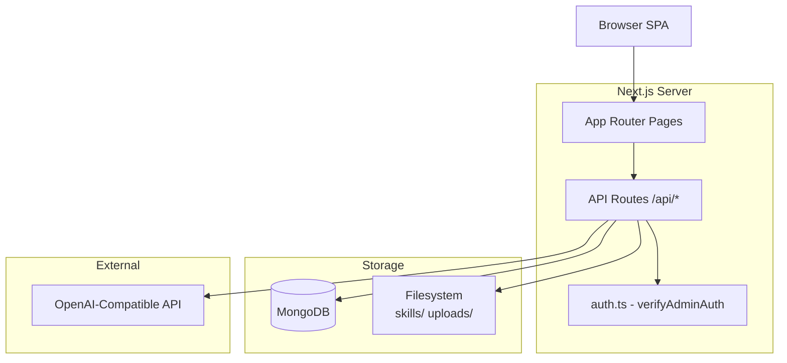

# Architecture

AutarkChat is a **single-admin, single-page-app chat console** built on Next.js 15 App Router. It has no multi-user support, no global state library, and no ORM — just the native MongoDB driver and React `useState` with `localStorage` persistence.

## Design Principle

The app is intentionally minimal: the backend is a thin RPC layer over MongoDB and the OpenAI SDK. The frontend is a SPA experience within Next.js — `ChatShell` orchestrates all state, and its children are pure render components.

## System Diagram

## Key Architectural Decisions

| Decision | Rationale | Location |
|---|---|---|
| **Single admin** | No multi-user SaaS complexity. `userId: "admin"` is hardcoded everywhere | `lib/chat/route.ts:401` |
| **Bearer token auth** | UUID stored in `localStorage`, verified via MongoDB sessions collection + in-memory Set cache | `lib/auth.ts:7-35` |
| **Native MongoDB driver** | No Mongoose overhead. Direct collection access | `lib/mongodb.ts` |
| **SSE streaming** | Server-sent events for real-time token delivery from LLM to browser | `lib/chat/route.ts:525-616` |
| **Embedded docs** | Messages and artifacts are embedded arrays in chat documents (not separate collections) | `lib/queries.ts` |
| **Filesystem skills** | Skills live as directories under `skills/`, loaded at runtime | `lib/skills.ts` |
| **No global state** | All client state is local `useState` + `localStorage` | `components/chat/shell.tsx` |

## Pages & Routes

| Path | Type | Purpose |
|---|---|---|
| `/` | Server | Redirects to `/chat` |
| `/chat` | SSR | New chat page (empty ChatShell) |
| `/chat/[id]` | SSR | Existing chat (loads messages from DB) |
| `/compare` | SSR | Model comparison setup page |
| `/login` | Client | Password login form |
| `/register` | Client | Redirects to `/login` (legacy dead route) |
| `/settings` | Client | General settings (theme, hotkeys, density, system metrics) |
| `/settings/personalization` | Client | Profile info & custom instructions |
| `/settings/models` | Client | Model registry CRUD |
| `/settings/sessions` | Client | Active session management |
| `/settings/skills` | Client | Skills console (install/enable/disable) |
| `/settings/usage` | Client | Token usage analytics |

## Next

- [Data Flow](./data-flow.md) — How a chat message travels from input to rendered response
- [Auth Flow](./auth-flow.md) — How authentication and session management work
