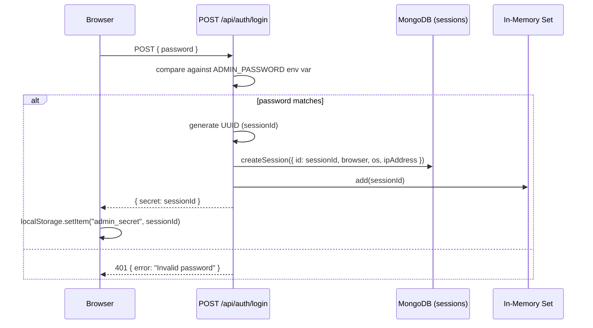

# Authentication & Authorization

## Overview

AutarkChat uses a **single-password admin system** with UUID-based bearer tokens. There are no user accounts, no OAuth, no multi-tenancy.

## Login Flow



## Request Verification

Every API route calls `verifyAdminAuth()` (`lib/auth.ts:7-35`):

```typescript
// From lib/auth.ts:7-35
export async function verifyAdminAuth(): Promise<boolean> {
  const headersList = await headers();
  const authHeader = headersList.get("authorization");
  if (!authHeader) return false;
  const token = authHeader.replace(/^Bearer\s+/i, "").trim();
  if (!token) return false;

  // 1. Hot cache check
  if (activeSessionsCache.has(token)) { ... return true; }

  // 2. DB fallback check
  const session = await db.collection("sessions").findOne({ id: token, isActive: true });
  if (session) { activeSessionsCache.add(token); ... return true; }

  return false;
}
```

The two-tier check means:
- **Hot path**: Already-verified tokens skip the DB call entirely (in-memory `Set`)
- **Cold path**: First request hits MongoDB, then gets cached
- **Session expiry**: Sessions are never auto-expired — they remain active until explicitly revoked

## Auth Conventions

- **Every API route** starts with `if (!await verifyAdminAuth()) return 401` (except `GET /api/skills`)
- **Client-side guard**: Pages check `localStorage.getItem("admin_secret")` and validate via `GET /api/auth/verify` on mount
- **Hardcoded userId**: All operations use `userId: "admin"` (`lib/chat/route.ts:401`)
- **Legacy cookie auth is dead**: `getSessionUser()` is removed. All auth is bearer-token only.

## Session Storage

Sessions are stored in MongoDB's `sessions` collection with:

```typescript
{
  id: string;         // UUID (the bearer token)
  name: string;       // Friendly name like "Chrome on macOS"
  browser: string;
  os: string;
  ipAddress: string;
  isActive: boolean;
  createdAt: Date;
  lastActiveAt: Date;
}
```

## API Endpoints

| Method | Path | Purpose |
|---|---|---|
| POST | `/api/auth/login` | Validate password, create session, return secret |
| GET | `/api/auth/session` | Check if current token is valid |
| GET | `/api/auth/verify` | Same as session — returns `{ success: true }` or 401 |
| POST | `/api/auth/logout` | Legacy — clears a cookie (no-op for bearer auth) |
| GET | `/api/sessions` | List all active sessions |
| DELETE | `/api/sessions?id=` | Revoke a session (removes from DB + cache) |
