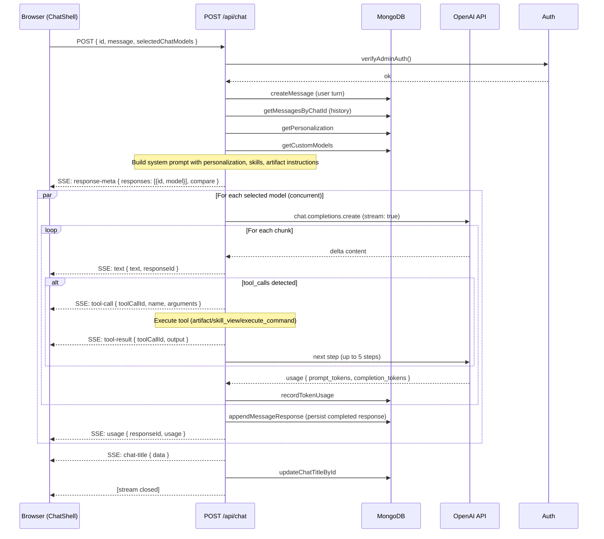

# Chat Data Flow

A single chat message triggers multiple rounds of streaming, tool execution, and persistence. Here's the full lifecycle.

## Key Details

### System Prompt Construction (`lib/chat/route.ts:478-518`)

The system prompt is assembled dynamically from:

1. **Base prompt** — `regularPrompt` from `lib/ai/prompts.ts:1`
2. **Personalization** — User name, occupation, about-me context if set
3. **Custom instructions** — Free-form guidelines from settings
4. **Enabled skills** — List of available skill names + descriptions, loaded from `skills/` directory
5. **Artifact instructions** — How to expose generated files via the `artifact` tool
6. **Command execution instructions** — How to use `execute_command` tool

### Response Model (`lib/chat/route.ts:145-358`)

- Multiple models run **concurrently** via `Promise.allSettled`
- Each model runs independently with a **multi-step tool loop** (up to 5 steps)
- A step is: LLM generates text → LLM calls tools (optional) → tools execute → results fed back → next step
- Token usage is recorded **per-chunk** via OpenAI `stream_options: { include_usage: true }`

### SSE Event Types

| Event Type | Payload | When |
|---|---|---|
| `response-meta` | `{ responses: [{id, model}], compare }` | Before any model starts |
| `text` | `{ text: string, responseId }` | Each text delta from any model |
| `tool-call` | `{ toolCallId, name, arguments, responseId }` | When a model calls a tool |
| `tool-result` | `{ toolCallId, output, responseId }` | After tool execution |
| `chat-title` | `{ data: string }` | Title generated |
| `usage` | `{ responseId, usage: { promptTokens, completionTokens, totalTokens } }` | Final usage per model |
| `error` | `{ error: string }` | Stream error |
